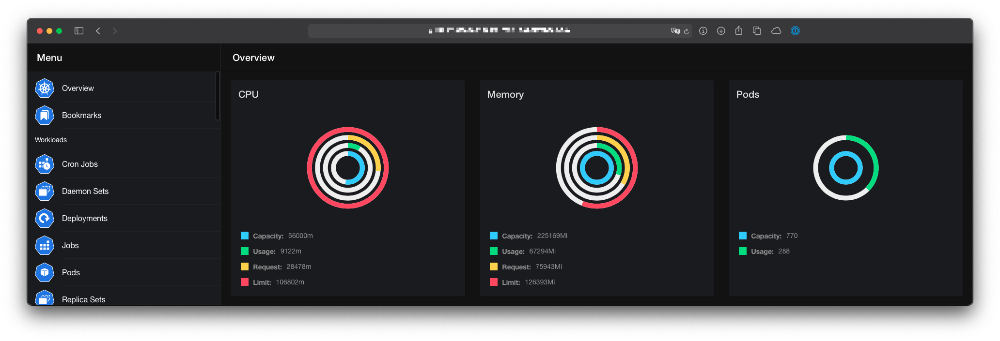
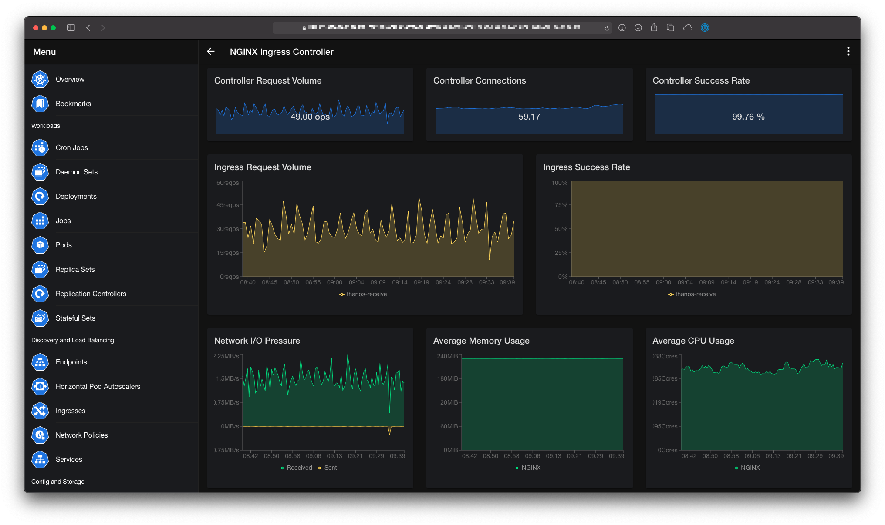

# Prometheus

The Prometheus plugin is used to display additional Prometheus metrics for Nodes, Deployments, StatefulSets, Pods, etc.

The plugin can be enabled in the **Settings** for the mobile and desktop version. To use the plugin in the web version you have to set the `--plugin.prometheus.enabled` flag. A detailed explanation of the each setting and the required command-line flags can be found in the respective documentation:

- [Mobile](../mobile/settings.md#prometheus)
- [Desktop](../desktop/settings.md#prometheus)
- [Web](../web/command-line-flags.md)

## Default Metrics

The Prometheus plugin supports some out of the box metrics for Nodes, Deployments, StatefulSets, Pods, etc. These metrics are generated by the [kube-state-metrics](https://github.com/kubernetes/kube-state-metrics) and the [node_exporter](https://github.com/prometheus/node_exporter), which must be installed by you.




## Dashboards

kubenav supports custom dashboards via the Prometheus plugin. To create a dashboard you have to create a ConfigMap in the defined dashboards namespace and with a label `kubenav.io/dashboard: "true"`.

```yaml
---
apiVersion: v1
kind: ConfigMap
metadata:
  name: nats-dashboard
  # Dashboards namespace, which is configured in the settings via "Dashboards Namespace" or via the "--plugin.prometheus.dashboards-namespace" command-line flag.
  namespace: kubenav
  labels:
    # Required label, so that kubenav can found the dashboard.
    kubenav.io/dashboard: "true"
data:
  # Title of the dashboard.
  title: "NATS"
  # Description of the dashboard.
  description: "Dashboard for NATS Metrics"
  # Array of variables.
  variables: |
    [
      {
        "name": "Namespace",
        "label": "namespace",
        "query": "gnatsd_varz_subscriptions",
        "allowAll": false
      },
      {
        "name": "Pod",
        "label": "pod",
        "query": "gnatsd_varz_subscriptions{namespace=~\"{{ .Namespace }}\"}",
        "allowAll": true
      }
    ]
  # Array of charts.
  charts: |
    [
      {
        "title": "Server CPU",
        "unit": "%",
        "size": {
          "xs": "12",
          "sm": "12",
          "md": "12",
          "lg": "6",
          "xl": "6"
        },
        "type": "area",
        "queries": [
          {
            "label": "{{ .pod }}",
            "query": "gnatsd_varz_cpu{namespace=~\"{{ .Namespace }}\",pod=~\"{{ .Pod }}\"}"
          }
        ]
      },
      {
        "title": "Server Memory",
        "unit": "MiB",
        "size": {
          "xs": "12",
          "sm": "12",
          "md": "12",
          "lg": "6",
          "xl": "6"
        },
        "type": "area",
        "queries": [
          {
            "label": "{{ .pod }}",
            "query": "gnatsd_varz_mem{namespace=~\"{{ .Namespace }}\",pod=~\"{{ .Pod }}\"} / 1024 / 1024"
          }
        ]
      }
    ]
```

### Variables

| Field | Description |
| ----- | ----------- |
| `name` | The name of the variable. The variable can then be used in other queries via `{{ .Name }}`. |
| `label` | Label from the returned Prometheus data, which should be used to fill the values of the variable. |
| `query` | Prometheus query, which should be used to get the values for the variable. |
| `allowAll` | Allows that the variable can have all values, which were returned from the query. Must be `true` or `false`. |

### Charts

| Field | Description |
| ----- | ----------- |
| `title` | Title for the chart. |
| `unit` | Unit for the Y-Axis. |
| `size` | Size defines the size of the chart in a 12 column grid layout. The size object should contain the following properties: `xs`, `sm`, `md`, `lg` and `xl` |
| `type` | The type of the chart. This must be `singlestat` or `area`, other types are currently not supported. |
| `queries` | An array of queries, which are used for the chart. Each query must contain a `label` and a `query`. |

### Annotations

You can also add a reference to a dashboard within a resource. For that you have to add the `kubenav.io/dashboards` annotation to the resource. The value is a comma seperated list of the ConfigMap names of the dashboards plus an optional query parameter.

For example to add the *NGINX Ingress Controller* dashboard to an Ingress, the resource has to look as follows:

```yaml
apiVersion: extensions/v1beta1
kind: Ingress
metadata:
  annotations:
    # Add the NGINX Ingress Controller and NGINX Ingress Controller: Request Handling Performance dashboard to the Ingress.
    # Set the Ingress variable to kubenav, so that the Ingress is selected in the dashboard.
    # The second dashboard uses the name of the Ingress as value for the Ingress variable.
    kubenav.io/dashboards: nginx-ingress-dashboard?Ingress=kubenav,nginx-ingress-request-handling-performance-dashboard?Ingress=$.metadata.name
    kubernetes.io/ingress.class: nginx
  name: kubenav
  namespace: kubenav
spec:
  rules:
  - host: dashboard.kubenav.io
    http:
      paths:
      - backend:
          serviceName: kubenav
          servicePort: http
        path: /
```

### Examples

In the [kubenav/deploy](https://github.com/kubenav/deploy/tree/master/dashboards) repository you can find some example dashboards, which are ready to use.

- [cert-manager](https://github.com/kubenav/deploy/blob/master/dashboards/cert-manager-dashboard.yaml)
- [Filebeat](https://github.com/kubenav/deploy/blob/master/dashboards/filebeat-dashboard.yaml)
- [Jaeger](https://github.com/kubenav/deploy/blob/master/dashboards/jaeger-dashboard.yaml)
- [NATS](https://github.com/kubenav/deploy/blob/master/dashboards/nats-dashboard.yaml)
- [NGINX Ingress Controller](https://github.com/kubenav/deploy/blob/master/dashboards/nginx-ingress-dashboard.yaml)
- [NGINX Ingress Controller: Request Handling Performance](https://github.com/kubenav/deploy/blob/master/dashboards/nginx-ingress-request-handling-performance-dashboard.yaml)
- [Redis](https://github.com/kubenav/deploy/blob/master/dashboards/redis-dashboard.yaml)
- [Redis Sentinel](https://github.com/kubenav/deploy/blob/master/dashboards/redis-sentinel-dashboard.yaml)
- [Reloader](https://github.com/kubenav/deploy/blob/master/dashboards/reloader-dashboard.yaml)


